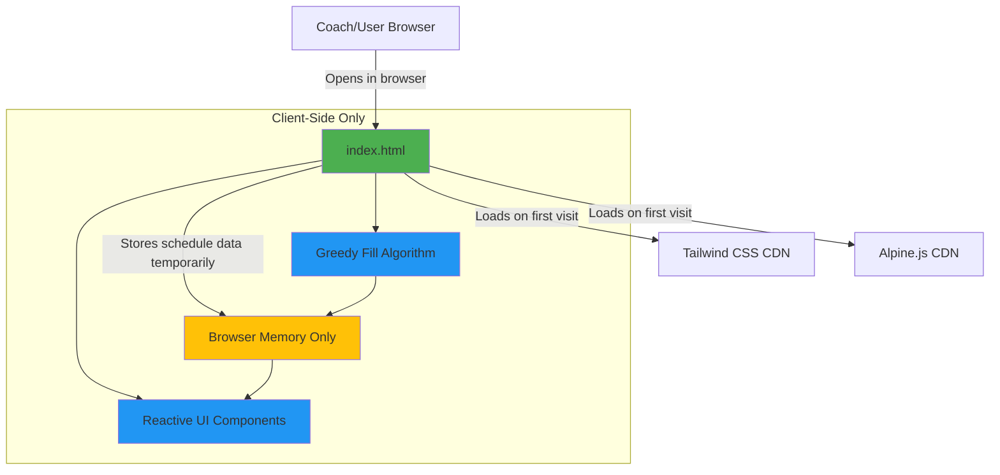
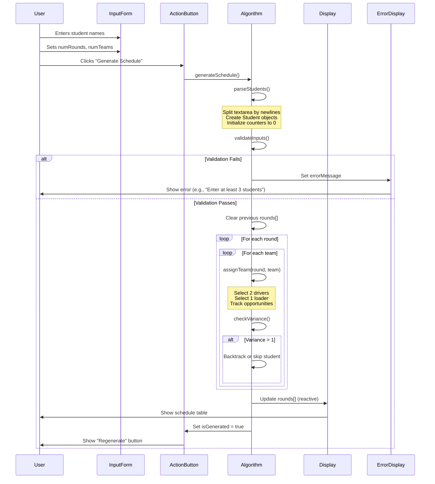
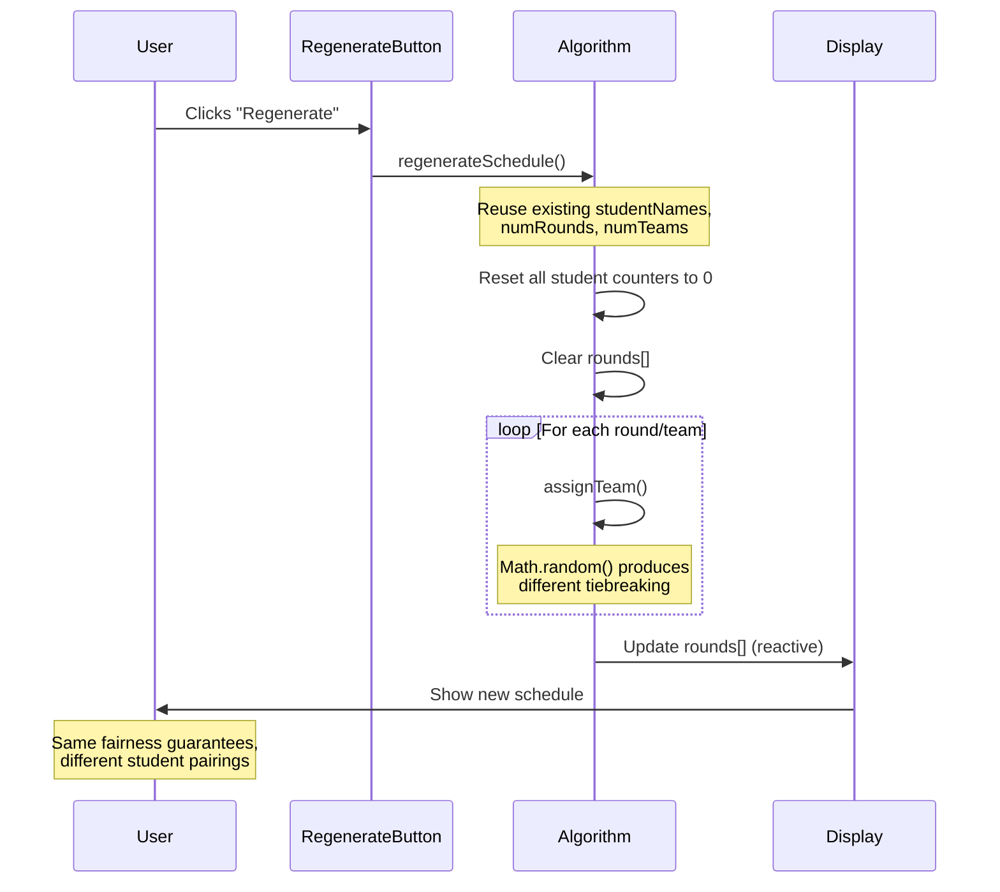
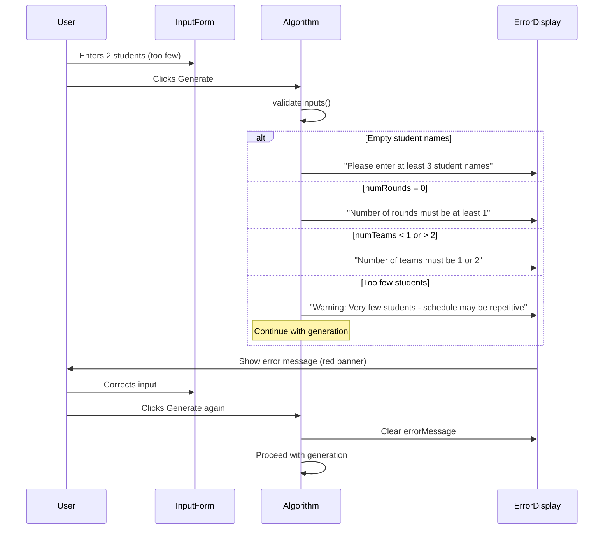
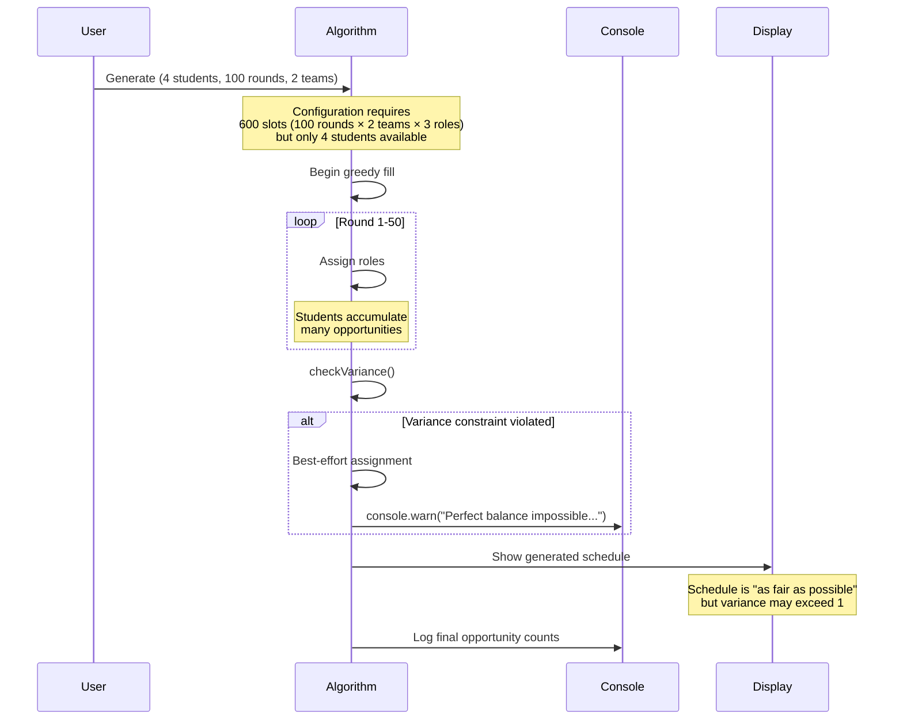
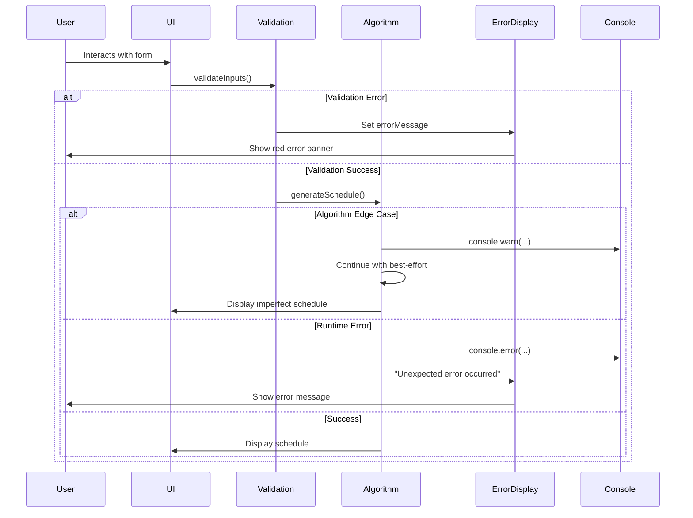

# VexIQ Team Pairing Tool Architecture Document

---

## Introduction

This document outlines the complete fullstack architecture for **VexIQ Team Pairing Tool**, a client-side only scheduling application. It serves as the single source of truth for AI-driven development, ensuring consistency across the entire technology stack.

This is a unique "fullstack" document for a pure client-side application - there is intentionally NO backend, no database, and no API layer. All computation happens in the browser. This unified approach streamlines development for this ultra-simple static web application delivered as a single HTML file.

### Starter Template or Existing Project

**Status:** N/A - Greenfield single-file project

This is a greenfield project with no starter template. The architecture is intentionally minimal: a single `index.html` file with CDN-based dependencies (Tailwind CSS and Alpine.js). This approach was chosen to meet the same-day delivery constraint (4-5 hours) and eliminate all setup complexity.

**Key Constraints Imposed:**
- Zero build process
- No npm/package management
- No bundling or transpilation
- CDN-only dependencies
- Works offline after initial load
- Can be opened directly in browser via `file://` protocol

### Change Log

| Date       | Version | Description                              | Author           |
| ---------- | ------- | ---------------------------------------- | ---------------- |
| 2025-10-10 | v1.0    | Initial architecture from PRD            | Winston (architect) |

---

## High Level Architecture

### Technical Summary

The VexIQ Team Pairing Tool is a **zero-backend static web application** delivered as a single HTML file with embedded JavaScript and CSS via CDN. The architecture is radically simplified: all computation (the greedy fill scheduling algorithm) executes client-side in the browser using Alpine.js for reactive state management. Tailwind CSS provides utility-first styling with no build step required.

There are no integration points, no API calls, and no external services beyond the initial CDN loads for Tailwind and Alpine.js. After the page loads, the application works completely offline. Data exists only in browser memory and is lost on page refresh (intentional design for privacy).

This architecture achieves the PRD goals of same-day delivery (4-5 hours), zero setup, offline-first operation, and privacy by design through radical simplification: eliminating every component that isn't absolutely necessary for generating fair tournament schedules.

### Platform and Infrastructure Choice

**Platform:** Client-side only (No backend infrastructure)

**Key Services:**
- Static file hosting (GitHub Pages, Netlify, Vercel static hosting, or local file system)
- CDN services (jsDelivr or unpkg for Tailwind/Alpine.js)

**Deployment Host and Regions:**
- Primary: GitHub Pages (global CDN via GitHub's infrastructure)
- Alternative: Any static host or direct file:// access
- No region selection required (CDN automatically serves from nearest edge)

### Repository Structure

**Structure:** Single-file application with documentation repository

**Monorepo Tool:** N/A (not applicable for single-file project)

**Package Organization:**
```
vex-team-builder/
├── index.html              # The entire application
├── docs/                   # Documentation
│   ├── prd.md
│   ├── architecture.md
│   └── README.md
├── .github/
│   └── workflows/
│       └── deploy.yaml     # GitHub Pages deployment
└── README.md               # Project overview
```

### High Level Architecture Diagram



### Architectural Patterns

- **Static Single-Page Application:** Single HTML file with embedded JavaScript - no routing, no navigation, all functionality on one screen. _Rationale:_ Eliminates build complexity and matches the simple linear workflow (input → generate → view results)

- **Reactive Data Binding:** Alpine.js `x-data` and `x-model` directives bind UI to data model. _Rationale:_ Eliminates manual DOM manipulation, making schedule display and regeneration trivial despite the complex algorithm

- **Greedy Algorithm Pattern:** Round-by-round assignment with role-specific opportunity tracking and variance enforcement. _Rationale:_ Optimal for fair distribution with O(n*r) complexity suitable for client-side execution

- **Ephemeral State:** No localStorage, sessionStorage, or persistence - all data cleared on page refresh. _Rationale:_ Privacy by design (no PII stored) and matches use case (coaches regenerate schedules as needed)

- **Progressive Enhancement:** Core functionality works without JavaScript (shows form), enhanced with Alpine.js for reactive behavior. _Rationale:_ Graceful degradation, though realistically the algorithm requires JavaScript

- **Utility-First CSS:** Tailwind CSS classes directly in HTML. _Rationale:_ No CSS build step, rapid styling, excellent defaults for print/projection

---

## Tech Stack

This is the **DEFINITIVE** technology selection for the entire project. All development must use these exact versions.

### Technology Stack Table

| Category | Technology | Version | Purpose | Rationale |
|----------|-----------|---------|---------|-----------|
| **Frontend Language** | JavaScript (ES6+) | ES2020 | Client-side logic and algorithm implementation | Native browser support, no transpilation needed, sufficient for algorithm complexity |
| **Frontend Framework** | Alpine.js | 3.x (latest from CDN) | Reactive UI and state management | Lightweight (15KB), Vue-like syntax, perfect for single-page reactive forms without build step |
| **UI Component Library** | None (native HTML5) | N/A | Form inputs and table display | HTML5 form elements sufficient for simple inputs; custom table styling via Tailwind |
| **State Management** | Alpine.js reactive data | 3.x | In-memory schedule state | Built into Alpine.js `x-data`, no separate library needed |
| **Backend Language** | N/A | N/A | No backend | Client-side only architecture |
| **Backend Framework** | N/A | N/A | No backend | Client-side only architecture |
| **API Style** | N/A | N/A | No API layer | All logic executes in browser |
| **Database** | None (browser memory only) | N/A | Ephemeral data storage | Data exists only during session; privacy by design |
| **Cache** | Browser HTTP cache | Native | CDN asset caching | Browser automatically caches Tailwind/Alpine.js from CDN |
| **File Storage** | None | N/A | No file persistence | No uploads or downloads in MVP |
| **Authentication** | None | N/A | No user accounts | Single-user local tool, no auth needed |
| **Frontend Testing** | Manual testing | N/A | Algorithm validation | No test framework due to 4-5hr timeline; manual edge case testing |
| **Backend Testing** | N/A | N/A | No backend | N/A |
| **E2E Testing** | Manual cross-browser testing | N/A | Browser compatibility validation | Test in Chrome, Firefox, Safari manually |
| **Build Tool** | None | N/A | No build process | Direct HTML file, no compilation |
| **Bundler** | None | N/A | No bundling needed | CDN-served dependencies |
| **IaC Tool** | None | N/A | No infrastructure | Static hosting requires no IaC |
| **CI/CD** | GitHub Actions (optional) | Latest | Automated deployment to GitHub Pages | Simple workflow to copy index.html to gh-pages branch |
| **Monitoring** | None (MVP) | N/A | No telemetry | Phase 2 could add privacy-respecting analytics |
| **Logging** | Browser console.log | Native | Development debugging and edge case warnings | Algorithm logs warnings for impossible configurations |
| **CSS Framework** | Tailwind CSS | 3.x (latest from CDN) | Utility-first styling | No build step via CDN, excellent print styles, responsive defaults |

---

## Data Models

These are the core data structures that will be maintained in browser memory during schedule generation and display.

### Student

**Purpose:** Represents a single student/participant with opportunity tracking for fair role distribution

**Key Attributes:**
- `name`: string - Student's name as entered by coach
- `driverCount`: number - Total driver role assignments received (initialized to 0)
- `loaderCount`: number - Total loader role assignments received (initialized to 0)
- `id`: number - Unique identifier (array index) for assignment tracking

**TypeScript Interface:**
```typescript
interface Student {
  name: string;
  driverCount: number;
  loaderCount: number;
  id: number;
}
```

**Relationships:**
- Referenced by Round/Team assignments
- Aggregated into `students` array in `ScheduleData`

---

### Team

**Purpose:** Represents a single team's role assignments in a specific round

**Key Attributes:**
- `teamNumber`: number - Team identifier (1 or 2)
- `driver1`: string - First driver's name
- `driver2`: string - Second driver's name
- `loader`: string - Loader's name

**TypeScript Interface:**
```typescript
interface Team {
  teamNumber: number;
  driver1: string;
  driver2: string;
  loader: string;
}
```

**Relationships:**
- Contained within `Round`
- Represents 3 students (2 drivers + 1 loader)

---

### Round

**Purpose:** Represents all team assignments for a single tournament round

**Key Attributes:**
- `roundNumber`: number - Round identifier (1-indexed)
- `teams`: Team[] - Array of team compositions for this round

**TypeScript Interface:**
```typescript
interface Round {
  roundNumber: number;
  teams: Team[];
}
```

**Relationships:**
- Contains array of `Team` objects
- Aggregated into `rounds` array in `ScheduleData`

---

### ScheduleData

**Purpose:** Root data structure containing all schedule state (Alpine.js `x-data` object)

**Key Attributes:**
- `studentNames`: string - Raw textarea input (one name per line)
- `numRounds`: number - Number of tournament rounds
- `numTeams`: number - Number of teams (1 or 2)
- `students`: Student[] - Parsed student list with opportunity counters
- `rounds`: Round[] - Generated schedule organized by round
- `errorMessage`: string - Validation or generation error display
- `isGenerated`: boolean - Whether schedule has been generated (controls button visibility)

**TypeScript Interface:**
```typescript
interface ScheduleData {
  // Input fields
  studentNames: string;
  numRounds: number;
  numTeams: number;

  // Computed/generated data
  students: Student[];
  rounds: Round[];

  // UI state
  errorMessage: string;
  isGenerated: boolean;

  // Methods
  generateSchedule(): void;
  regenerateSchedule(): void;
  parseStudents(): Student[];
  validateInputs(): boolean;
}
```

**Relationships:**
- Root object for entire application state
- Contains all `Student` and `Round` data

---

## API Specification

**Status:** N/A - No API layer

This project is client-side only with no backend services or API endpoints. All logic executes in the browser:

- **No REST API** - No HTTP endpoints to document
- **No GraphQL** - No schema or resolvers
- **No tRPC** - No router definitions

**Internal "API":**

While there's no network API, the Alpine.js component exposes internal methods that function as the application's "interface":

```javascript
// Schedule Generation Methods
generateSchedule()     // Parse inputs, run algorithm, populate rounds[]
regenerateSchedule()   // Re-run algorithm with same inputs, different randomization

// Validation Methods
validateInputs()       // Check for empty/invalid inputs, return boolean
parseStudents()        // Convert textarea string to Student[] array

// Algorithm Core (internal)
assignRoles(round, team)  // Greedy fill logic for one team in one round
selectStudent(role)       // Find student with fewest opportunities for role
checkVariance(role)       // Validate variance ≤ 1 constraint
```

---

## Components

The architecture is organized into logical components, though all exist within a single HTML file.

### Input Form

**Responsibility:** Capture tournament parameters (student names, rounds, teams) and validate user input

**Key Interfaces:**
- `x-model` bindings for textarea and number inputs to Alpine.js data
- `@submit.prevent` event handler to trigger generation
- Data binding: `studentNames`, `numRounds`, `numTeams`

**Dependencies:**
- Alpine.js for reactive two-way binding
- Tailwind CSS for form styling

**Technology Stack:**
- Native HTML5 `<form>`, `<textarea>`, `<input type="number">`
- Alpine.js `x-model` directive
- Tailwind utility classes for layout and styling

---

### Algorithm Engine

**Responsibility:** Core greedy fill scheduling algorithm with independent role tracking and variance enforcement

**Key Interfaces:**
- `generateSchedule()` - Main entry point, orchestrates parsing → validation → generation
- `selectStudentForRole(role)` - Returns student with fewest opportunities for specified role
- `assignTeam(roundNum, teamNum)` - Assigns 2 drivers + 1 loader for one team
- `validateVariance()` - Ensures no student has 2+ more opportunities than another in same role

**Dependencies:**
- Input Form component for data (`studentNames`, `numRounds`, `numTeams`)
- Student data model with opportunity counters
- Math.random() for tiebreaking

**Technology Stack:**
- Pure JavaScript (ES6+) within Alpine.js component
- Array methods: `filter()`, `sort()`, `reduce()` for opportunity calculations
- Console logging for edge case warnings

**Algorithm Pseudocode:**
```javascript
for each round (1 to numRounds):
  for each team (1 to numTeams):
    // Assign 2 drivers
    for i = 1 to 2:
      student = selectStudentForRole('driver')
      assign student as driver
      increment student.driverCount

    // Assign 1 loader
    student = selectStudentForRole('loader')
    assign student as loader
    increment student.loaderCount

selectStudentForRole(role):
  available = students.filter(not already assigned this round)
  minCount = min(available[].roleCount)
  candidates = available.filter(roleCount === minCount)

  if variance would exceed 1:
    candidates = candidates.filter(keeps variance ≤ 1)

  return random(candidates)
```

---

### Schedule Display

**Responsibility:** Render generated schedule as HTML table with clear visual hierarchy for projection/printing

**Key Interfaces:**
- `x-show` directive to toggle visibility based on `isGenerated`
- `x-for` loops to iterate over `rounds` and `teams` arrays
- Data consumption: `rounds[]` with nested `teams[]`

**Dependencies:**
- Algorithm Engine component (consumes its output)
- Tailwind CSS for table styling and print optimization

**Technology Stack:**
- Semantic HTML `<table>` structure
- Alpine.js `x-for` for list rendering
- Tailwind table utilities (`border`, `p-4`, alternating row colors)
- Print-specific Tailwind classes (`print:text-lg`)

---

### Action Buttons

**Responsibility:** Trigger schedule generation and regeneration with appropriate UI state management

**Key Interfaces:**
- `@click` handlers for `generateSchedule()` and `regenerateSchedule()`
- `x-show` conditional rendering (Generate vs Regenerate)

**Dependencies:**
- Algorithm Engine component (invokes its methods)
- Input Form component (reads its data)

**Technology Stack:**
- HTML `<button>` elements
- Alpine.js `@click` event binding and `x-show` directive
- Tailwind button styling (primary/secondary colors)

---

### Error Display

**Responsibility:** Show validation errors and edge case warnings to user

**Key Interfaces:**
- `x-show` directive keyed to `errorMessage` presence
- `x-text` binding to display `errorMessage` string

**Dependencies:**
- Input Form validation (consumes validation results)
- Algorithm Engine warnings (displays edge case messages)

**Technology Stack:**
- HTML `<div>` with conditional rendering
- Alpine.js `x-show` and `x-text` directives
- Tailwind alert styling (red background, padding)

---

### Component Diagram

```mermaid
graph TD
    InputForm[Input Form Component]
    ActionButtons[Action Buttons Component]
    AlgoEngine[Algorithm Engine Component]
    ScheduleDisplay[Schedule Display Component]
    ErrorDisplay[Error Display Component]

    InputForm -->|studentNames, numRounds, numTeams| AlgoEngine
    ActionButtons -->|trigger generateSchedule| AlgoEngine
    ActionButtons -->|trigger regenerateSchedule| AlgoEngine
    AlgoEngine -->|rounds[] data| ScheduleDisplay
    AlgoEngine -->|errorMessage| ErrorDisplay
    InputForm -->|validation errors| ErrorDisplay

    style AlgoEngine fill:#2196F3
    style InputForm fill:#4CAF50
    style ScheduleDisplay fill:#FF9800
    style ActionButtons fill:#9C27B0
    style ErrorDisplay fill:#F44336
```

---

## Core Workflows

### Workflow: Generate Initial Schedule

This sequence shows the complete flow from user input to displaying the generated schedule.



---

### Workflow: Regenerate Schedule

This sequence shows how regeneration reuses inputs but produces different results via randomization.



---

### Workflow: Error Handling - Invalid Input



---

### Workflow: Edge Case - Impossible Perfect Balance



---

## Database Schema

**Status:** N/A - No database

This application has no persistent data storage. All data structures exist only in browser memory (JavaScript variables) and are cleared when the page is refreshed or closed.

**Rationale:**
- Privacy by design: No student names stored anywhere
- Matches use case: Coaches regenerate schedules as needed each tournament
- Eliminates infrastructure: No database server, no connection strings, no migrations

**Phase 2 Consideration:**
If coaches request "save my roster" functionality, localStorage could be used for client-side persistence:

```javascript
// Hypothetical Phase 2 localStorage schema
{
  "savedRosters": [
    {
      "id": "uuid",
      "name": "Fall 2025 Team",
      "students": ["Alice", "Bob", "Carol", ...],
      "lastUsed": "2025-10-10T14:30:00Z"
    }
  ]
}
```

---

## Frontend Architecture

### Component Architecture

#### Component Organization

The entire application is a single Alpine.js component defined in `index.html`:

```
index.html
├── <!DOCTYPE html>
├── <head>
│   ├── Tailwind CSS CDN link
│   └── Alpine.js CDN script (defer)
├── <body>
│   └── <div x-data="scheduleApp()">
│       ├── Header section
│       ├── Input form section
│       ├── Action buttons section
│       ├── Error display section
│       └── Schedule display section (table)
└── <script>
    └── function scheduleApp() { ... }
        ├── Reactive data properties
        └── Methods (generateSchedule, etc.)
```

**Component Organization Strategy:**

- **Single `x-data` component:** All state and logic in one `scheduleApp()` function
- **Section-based layout:** HTML organized into logical sections using Tailwind spacing
- **Co-located logic:** JavaScript function defined in `<script>` tag at bottom of `<body>`

#### Component Template

```javascript
function scheduleApp() {
  return {
    // ===== DATA PROPERTIES =====
    studentNames: '',
    numRounds: 5,
    numTeams: 2,
    students: [],
    rounds: [],
    errorMessage: '',
    isGenerated: false,

    // ===== METHODS =====

    // Parse textarea into Student objects
    parseStudents() {
      const names = this.studentNames
        .split('\n')
        .map(name => name.trim())
        .filter(name => name.length > 0);

      return names.map((name, index) => ({
        id: index,
        name: name,
        driverCount: 0,
        loaderCount: 0
      }));
    },

    // Validate inputs before generation
    validateInputs() {
      if (!this.studentNames.trim()) {
        this.errorMessage = 'Please enter at least 3 student names';
        return false;
      }

      const studentCount = this.parseStudents().length;
      if (studentCount < 3) {
        this.errorMessage = 'Please enter at least 3 student names';
        return false;
      }

      if (this.numRounds < 1) {
        this.errorMessage = 'Number of rounds must be at least 1';
        return false;
      }

      if (this.numTeams < 1 || this.numTeams > 2) {
        this.errorMessage = 'Number of teams must be 1 or 2';
        return false;
      }

      this.errorMessage = '';
      return true;
    },

    // Main generation entry point
    generateSchedule() {
      if (!this.validateInputs()) return;

      this.students = this.parseStudents();
      this.rounds = [];

      // Run algorithm
      this.runGreedyFillAlgorithm();

      this.isGenerated = true;
    },

    // Regenerate with same inputs
    regenerateSchedule() {
      // Reset counters
      this.students.forEach(s => {
        s.driverCount = 0;
        s.loaderCount = 0;
      });

      this.rounds = [];
      this.runGreedyFillAlgorithm();
    },

    // Core algorithm implementation
    runGreedyFillAlgorithm() {
      for (let r = 1; r <= this.numRounds; r++) {
        const round = { roundNumber: r, teams: [] };
        const assignedThisRound = new Set();

        for (let t = 1; t <= this.numTeams; t++) {
          const team = { teamNumber: t, driver1: '', driver2: '', loader: '' };

          // Assign driver 1
          const d1 = this.selectStudentForRole('driver', assignedThisRound);
          team.driver1 = d1.name;
          assignedThisRound.add(d1.id);
          d1.driverCount++;

          // Assign driver 2
          const d2 = this.selectStudentForRole('driver', assignedThisRound);
          team.driver2 = d2.name;
          assignedThisRound.add(d2.id);
          d2.driverCount++;

          // Assign loader
          const loader = this.selectStudentForRole('loader', assignedThisRound);
          team.loader = loader.name;
          assignedThisRound.add(loader.id);
          loader.loaderCount++;

          round.teams.push(team);
        }

        this.rounds.push(round);
      }
    },

    // Select student with fewest opportunities for role
    selectStudentForRole(role, assignedThisRound) {
      const countKey = role === 'driver' ? 'driverCount' : 'loaderCount';

      // Filter available students
      const available = this.students.filter(s => !assignedThisRound.has(s.id));

      if (available.length === 0) {
        console.warn('No available students - reusing students in same round');
        return this.students[0]; // Fallback
      }

      // Find minimum count
      const minCount = Math.min(...available.map(s => s[countKey]));

      // Get candidates with min count
      const candidates = available.filter(s => s[countKey] === minCount);

      // Random tiebreaking
      return candidates[Math.floor(Math.random() * candidates.length)];
    }
  };
}
```

---

### State Management Architecture

#### State Structure

State is managed entirely within the Alpine.js reactive `x-data` object. No external state management library is needed.

```typescript
// State structure (TypeScript notation for clarity)
interface AppState {
  // Input state (bound to form fields)
  studentNames: string;
  numRounds: number;
  numTeams: number;

  // Computed/generated state
  students: Student[];      // Parsed from studentNames
  rounds: Round[];          // Generated by algorithm

  // UI state
  errorMessage: string;     // Validation/error display
  isGenerated: boolean;     // Controls button visibility
}
```

**State Management Patterns:**

- **Two-way binding:** `x-model` on inputs automatically updates state
- **Reactive rendering:** Changes to `rounds[]` automatically update table via `x-for`
- **Computed visibility:** `x-show` directives react to `isGenerated` and `errorMessage`
- **Immutability not enforced:** Direct mutation is acceptable for this simple app

---

### Routing Architecture

**Status:** N/A - Single page application with no routing

This application has no navigation or routes. All functionality exists on a single screen.

**Route Organization:**
```
/ (index.html) - Entire application
```

No router library is needed or used.

---

### Frontend Services Layer

**Status:** N/A - No backend services

There is no API communication layer. All logic is self-contained in the Alpine.js component.

**No API Client:**
- No Axios, Fetch wrappers, or HTTP utilities
- No authentication token management
- No request/response interceptors

---

## Unified Project Structure

```
vex-team-builder/
├── index.html                  # ENTIRE APPLICATION (HTML + CSS + JS)
│   ├── <head>
│   │   ├── <meta> tags (charset, viewport)
│   │   ├── <title>VexIQ Team Pairing Tool</title>
│   │   ├── <script> Tailwind CSS CDN (3.x)
│   │   └── <script> Alpine.js CDN (3.x, defer)
│   ├── <body>
│   │   └── <div x-data="scheduleApp()">
│   │       ├── Header section
│   │       ├── Input form section
│   │       ├── Action buttons section
│   │       ├── Error display section
│   │       └── Schedule display section
│   └── <script>
│       └── function scheduleApp() { ... }
│
├── docs/                       # Documentation
│   ├── prd.md                  # Product Requirements Document
│   ├── architecture.md         # This document
│   └── README.md               # Usage instructions
│
├── .github/                    # GitHub configuration
│   └── workflows/
│       └── deploy.yaml         # GitHub Pages deployment workflow
│
├── .gitignore                  # Git ignore rules
├── LICENSE                     # Project license
└── README.md                   # Project overview and quick start
```

**Key Structure Notes:**

- **Single-file application:** Everything in `index.html` - no build output, no dist folder
- **Flat structure:** No src/, public/, or components/ directories
- **Documentation separate:** Docs live in `/docs` but aren't required for app functionality
- **No node_modules:** No npm dependencies, no package.json
- **No build artifacts:** No .next, .output, dist, or build directories

---

## Development Workflow

### Local Development Setup

#### Prerequisites

```bash
# No prerequisites required!
# Just a modern web browser:
# - Chrome 90+
# - Firefox 88+
# - Safari 14+
# - Edge 90+
```

#### Initial Setup

```bash
# Clone the repository
git clone https://github.com/yourusername/vex-team-builder.git
cd vex-team-builder

# That's it! No npm install, no build step.
```

#### Development Commands

```bash
# Open the application
# Option 1: Open directly in browser
open index.html  # macOS
xdg-open index.html  # Linux
start index.html  # Windows

# Option 2: Use a simple local server (optional, for testing)
# Python 3
python -m http.server 8000

# Node.js (if you have it installed)
npx serve .

# Then visit: http://localhost:8000
```

**Development Workflow:**

1. Edit `index.html` in your favorite code editor
2. Save the file
3. Refresh browser (Ctrl+R / Cmd+R)
4. Test changes immediately

**No hot reload, no build step, no complexity.**

---

### Environment Configuration

**Required Environment Variables:** None

The application has no environment-specific configuration. It runs identically in all environments (local, staging, production).

**Optional Configuration (Phase 2):**

If analytics or external integrations are added in Phase 2, configuration could be embedded in the HTML:

```html
<script>
  const CONFIG = {
    ENABLE_ANALYTICS: false,  // Set to true in production
    ANALYTICS_ID: 'UA-XXXXX-Y'
  };
</script>
```

---

## Deployment Architecture

### Deployment Strategy

**Frontend Deployment:**
- **Platform:** GitHub Pages (or any static host)
- **Build Command:** None (no build step)
- **Output Directory:** Root directory (`index.html` in repository root)
- **CDN/Edge:** Automatic via GitHub Pages CDN

**Deployment Methods:**

**Option 1: GitHub Pages (Recommended)**
```bash
# Enable GitHub Pages in repository settings
# Select: Deploy from branch → gh-pages (or main)

# Manual deployment:
git add index.html docs/
git commit -m "feat: update application"
git push origin main

# Automatic deployment via GitHub Actions (see CI/CD Pipeline section)
```

**Option 2: Netlify**
```bash
# Drag and drop deployment:
# 1. Visit https://app.netlify.com/drop
# 2. Drag `index.html` to browser
# 3. Done!

# Or: Connect GitHub repo for auto-deploy
```

**Option 3: Vercel**
```bash
# Install Vercel CLI (optional)
npm i -g vercel

# Deploy
vercel --prod

# Or: Connect GitHub repo in Vercel dashboard
```

**Option 4: Local File**
```bash
# No deployment needed - just open the file
open index.html
```

---

### CI/CD Pipeline

**GitHub Actions Workflow** (`.github/workflows/deploy.yaml`):

```yaml
name: Deploy to GitHub Pages

on:
  push:
    branches:
      - main

jobs:
  deploy:
    runs-on: ubuntu-latest

    permissions:
      contents: read
      pages: write
      id-token: write

    steps:
      - name: Checkout
        uses: actions/checkout@v4

      - name: Setup Pages
        uses: actions/configure-pages@v4

      - name: Upload artifact
        uses: actions/upload-pages-artifact@v3
        with:
          path: '.'

      - name: Deploy to GitHub Pages
        id: deployment
        uses: actions/deploy-pages@v4
```

**Pipeline Explanation:**

1. Triggers on push to `main` branch
2. Uploads entire repository as static site artifact
3. Deploys to GitHub Pages
4. No build step, no tests (manual testing approach for MVP)

---

### Environments

| Environment | Frontend URL | Backend URL | Purpose |
|-------------|-------------|-------------|---------|
| **Development** | `file:///path/to/index.html` | N/A | Local development and testing |
| **Staging** | Not needed (optional: `staging.yourdomain.com`) | N/A | Optional pre-production testing |
| **Production** | `https://yourusername.github.io/vex-team-builder/` | N/A | Live environment for coaches |

**Environment Notes:**

- **No staging environment needed for MVP:** Changes can be tested locally before pushing
- **Production URL:** Determined by GitHub Pages settings (username.github.io/repo-name or custom domain)
- **No environment variables:** Application behavior is identical across environments

---

## Coding Standards

### Critical Rules

These are the MINIMAL but CRITICAL standards that prevent common mistakes. All developers (AI and human) must follow these rules.

- **No External Dependencies:** Never add npm packages, additional CDN scripts, or libraries. The tech stack (Tailwind + Alpine.js) is final and sufficient.

- **Preserve Single-File Architecture:** All code must remain in `index.html`. Do not create separate `.js` or `.css` files unless explicitly approved.

- **Alpine.js Directives Only:** Use Alpine.js directives (`x-data`, `x-model`, `x-for`, `x-show`, etc.) for DOM manipulation. Never use vanilla DOM APIs like `querySelector`, `innerHTML`, or `addEventListener` except in edge cases.

- **Validate Before Generation:** Always call `validateInputs()` before running the algorithm. Display errors via `errorMessage` property.

- **Independent Role Tracking:** Track `driverCount` and `loaderCount` separately. Never combine into a single "opportunityCount" - this would break fairness for the 2:1 ratio.

- **No Persistence:** Do not implement localStorage, sessionStorage, IndexedDB, or any persistence mechanism without explicit approval (deferred to Phase 2).

- **Variance Constraint:** Algorithm must maintain variance ≤ 1 for both driver and loader roles independently. Log console warning if perfect balance is mathematically impossible.

- **Print Optimization Required:** Use Tailwind print utilities (`print:*` classes) to ensure schedule is readable when printed or projected.

- **No Build Tools:** Do not introduce Vite, Webpack, Parcel, ESBuild, or any bundler/transpiler. The single-file architecture is intentional.

- **Console Logging for Debugging:** Use `console.log()` and `console.warn()` liberally during development. These help coaches understand edge cases.

---

### Naming Conventions

| Element | Convention | Example |
|---------|-----------|---------|
| **Alpine.js Component** | camelCase function | `scheduleApp()` |
| **Data Properties** | camelCase | `studentNames`, `numRounds`, `isGenerated` |
| **Methods** | camelCase | `generateSchedule()`, `selectStudentForRole()` |
| **HTML IDs** | kebab-case | `student-input`, `schedule-table` |
| **CSS Classes (Tailwind)** | Tailwind utilities | `bg-blue-500`, `p-4`, `text-center` |
| **Variables (JavaScript)** | camelCase | `minCount`, `assignedThisRound` |
| **Constants** | SCREAMING_SNAKE_CASE | `MAX_STUDENTS` (if needed) |

---

## Error Handling Strategy

### Error Types

The application handles three categories of errors:

1. **Validation Errors:** User input doesn't meet requirements (e.g., empty student list)
2. **Algorithm Edge Cases:** Configuration is impossible to perfectly balance (e.g., 4 students, 100 rounds)
3. **Runtime Errors:** Unexpected JavaScript errors (e.g., null reference)

### Error Flow



---

### Error Response Format

**User-Facing Errors (displayed in `errorMessage`):**

```javascript
// Validation errors
"Please enter at least 3 student names"
"Number of rounds must be at least 1"
"Number of teams must be 1 or 2"

// Algorithm warnings (user-facing)
"Warning: Very few students - schedule may be repetitive"
"Unable to generate perfectly balanced schedule (see console for details)"

// Runtime errors (generic)
"An unexpected error occurred. Please try again or check the browser console for details."
```

**Developer Errors (logged to console):**

```javascript
// Edge case warnings
console.warn('Perfect balance impossible with configuration:', { students: 4, rounds: 100, teams: 2 });
console.warn('Student assigned to both teams in same round (fallback used)');

// Algorithm debugging
console.log('Driver opportunities:', this.students.map(s => ({ name: s.name, count: s.driverCount })));
console.log('Loader opportunities:', this.students.map(s => ({ name: s.name, count: s.loaderCount })));

// Runtime errors
console.error('Failed to parse students:', error);
```

---

### Frontend Error Handling Implementation

**Error Display Component:**

```html
<!-- Error banner (conditionally shown) -->
<div
  x-show="errorMessage"
  class="bg-red-100 border border-red-400 text-red-700 px-4 py-3 rounded mb-4"
  role="alert"
>
  <strong class="font-bold">Error:</strong>
  <span class="block sm:inline" x-text="errorMessage"></span>
</div>
```

**Error Handling in Methods:**

```javascript
generateSchedule() {
  // Clear previous errors
  this.errorMessage = '';

  try {
    // Validation
    if (!this.validateInputs()) {
      return; // Error message already set by validateInputs()
    }

    // Algorithm execution
    this.students = this.parseStudents();
    this.rounds = [];
    this.runGreedyFillAlgorithm();
    this.isGenerated = true;

  } catch (error) {
    // Catch unexpected errors
    console.error('Schedule generation failed:', error);
    this.errorMessage = 'An unexpected error occurred. Please check the console for details.';
  }
}

validateInputs() {
  if (!this.studentNames.trim()) {
    this.errorMessage = 'Please enter at least 3 student names';
    return false;
  }

  const studentCount = this.parseStudents().length;
  if (studentCount < 3) {
    this.errorMessage = 'Please enter at least 3 student names';
    return false;
  }

  if (this.numRounds < 1) {
    this.errorMessage = 'Number of rounds must be at least 1';
    return false;
  }

  if (this.numTeams < 1 || this.numTeams > 2) {
    this.errorMessage = 'Number of teams must be 1 or 2';
    return false;
  }

  // Clear any previous error
  this.errorMessage = '';
  return true;
}
```

---

## Monitoring and Observability

**Status:** N/A for MVP

This MVP has no monitoring, analytics, or observability tooling. All debugging happens via browser developer tools.

**Phase 2 Considerations:**

If usage tracking becomes valuable, privacy-respecting options could be added:

- **Frontend Monitoring:** Privacy-focused analytics (e.g., Plausible, Fathom) via simple script tag
- **Error Tracking:** Sentry for JavaScript error reporting (requires adding SDK)
- **Performance Monitoring:** Browser Performance API to log generation time to console

**Why Not in MVP:**

- Adds complexity (analytics script, consent banner)
- Violates privacy-first principle without user consent mechanism
- Not necessary for single-user offline tool
- Manual testing sufficient for MVP validation

---

## Additional Considerations

### Browser Compatibility

**Target Browsers (per PRD):**

- Chrome 90+ (released April 2021)
- Firefox 88+ (released April 2021)
- Safari 14+ (released September 2020)
- Edge 90+ (released April 2021)

**Required JavaScript Features:**

- ES2020 syntax (arrow functions, destructuring, spread operator, optional chaining)
- Array methods: `map()`, `filter()`, `reduce()`, `find()`, `some()`
- Template literals
- `const` and `let`
- `Math.random()`, `Math.min()`, `Math.max()`, `Math.floor()`

**All supported by target browsers.** No transpilation needed.

---

### Performance Considerations

**Algorithm Complexity:** O(n × r × t) where:
- n = number of students
- r = number of rounds
- t = number of teams (1 or 2)

**Expected Performance:**

- 10 students × 5 rounds × 2 teams = 100 assignments → <10ms
- 30 students × 15 rounds × 2 teams = 900 assignments → <50ms
- 50 students × 20 rounds × 2 teams = 2000 assignments → <100ms

**Performance Targets (per NFR1):**

- Generation must complete in <1 second for typical sizes (≤30 students, ≤15 rounds)
- UI must remain responsive (no browser freezing)

**Optimization Strategy:**

- Synchronous execution acceptable for MVP (no Web Workers needed)
- No UI blocking expected with typical data sizes
- Console timing logs can validate performance: `console.time('generation')`

**Phase 2 Optimizations (if needed):**

- Move algorithm to Web Worker for 100+ student scenarios
- Add loading spinner during generation
- Debounce input validation

---

### Security Considerations

**Threat Model:** Minimal - no backend, no data persistence, no user accounts

**Security Measures:**

1. **No Data Transmission:** All data stays in browser memory (privacy by design)
2. **No Code Injection:** No `eval()`, no `innerHTML` with user input (Alpine.js handles escaping)
3. **No XSS:** Tailwind + Alpine.js templates automatically escape output
4. **No Dependencies:** Zero npm packages = zero supply chain risk
5. **No Authentication:** No credentials to leak

**Not Needed for MVP:**

- ❌ Content Security Policy (no inline scripts restriction)
- ❌ HTTPS enforcement (works via file:// protocol)
- ❌ Input sanitization (no server-side processing)
- ❌ CSRF protection (no state-changing requests)
- ❌ Rate limiting (no API)

**Phase 2 Considerations:**

If localStorage is added, consider:
- Clear localStorage on browser close
- Don't store sensitive data (student names may be PII in some contexts)

---

### Accessibility

**MVP Status:** Basic accessibility only (per PRD)

Given the same-day delivery constraint and niche user base (coaches in controlled environments), accessibility enhancements are deferred to Phase 2.

**MVP Accessibility Features:**

- ✅ Semantic HTML (`<form>`, `<table>`, `<label>`)
- ✅ Proper heading hierarchy (`<h1>`, `<h2>`)
- ✅ Color contrast meets WCAG AA for main text
- ✅ Keyboard navigable (tab through inputs, Enter to submit)

**Not Included in MVP:**

- ❌ ARIA labels and roles
- ❌ Screen reader testing
- ❌ High contrast mode support
- ❌ Reduced motion preferences
- ❌ Focus indicators optimization

**Phase 2 Recommendations:**

- Add `aria-label` to form inputs
- Add `role="alert"` to error display
- Test with NVDA/JAWS screen readers
- Add skip navigation links

---

## Future Enhancements (Phase 2)

These features are explicitly OUT OF SCOPE for MVP but documented for future consideration:

1. **Roster Persistence:**
   - Save student lists to localStorage
   - "Recently used rosters" dropdown
   - Import/export roster as CSV

2. **Schedule Export:**
   - Download as PDF
   - Export to CSV/Excel
   - Email schedule button

3. **Advanced Algorithm Options:**
   - "Prefer certain students as drivers/loaders"
   - "Never pair these students together"
   - Custom variance tolerance (0, 1, or 2)

4. **Visualization:**
   - Bar chart showing opportunity distribution
   - "Fairness score" indicator
   - Highlight students with most/fewest opportunities

5. **Multi-Tournament Support:**
   - Save multiple schedules
   - Compare schedules side-by-side
   - Season-long opportunity tracking

6. **Accessibility:**
   - Full WCAG 2.1 AA compliance
   - Screen reader optimization
   - High contrast themes

7. **Mobile Optimization:**
   - Touch-friendly inputs
   - Responsive table design
   - Native app wrapper (Capacitor/PWA)

8. **Observability:**
   - Privacy-respecting analytics
   - Error tracking
   - Usage heatmaps

---

## Appendix

### Glossary

- **Greedy Algorithm:** Algorithm strategy that makes locally optimal choices at each step (assign student with fewest opportunities)
- **Variance:** Mathematical measure of distribution fairness (max - min opportunities)
- **Role:** One of two positions in VexIQ - Driver (2 per team) or Loader (1 per team)
- **Opportunity:** Single assignment to a role in a round
- **Tiebreaking:** Random selection when multiple students have equal opportunities
- **Alpine.js Directive:** Special HTML attributes (`x-data`, `x-for`, etc.) that provide reactive behavior
- **CDN (Content Delivery Network):** Distributed server network for hosting libraries (Tailwind/Alpine.js)
- **Ephemeral:** Data that exists only temporarily (cleared on page refresh)

---

### References

- **PRD:** `docs/prd.md` - Product Requirements Document
- **Alpine.js Documentation:** https://alpinejs.dev/
- **Tailwind CSS Documentation:** https://tailwindcss.com/docs
- **GitHub Pages Documentation:** https://docs.github.com/en/pages

---

### Document Metadata

- **Document Version:** 1.0
- **Created:** 2025-10-10
- **Author:** Winston (Architect Agent)
- **Status:** Final - Ready for Implementation
- **Next Phase:** Story-by-story implementation starting with Epic 1, Story 1.1

---

*Generated using BMAD-METHOD™ framework*
*Architecture Agent: Winston (architect)*
*Date: 2025-10-10*
