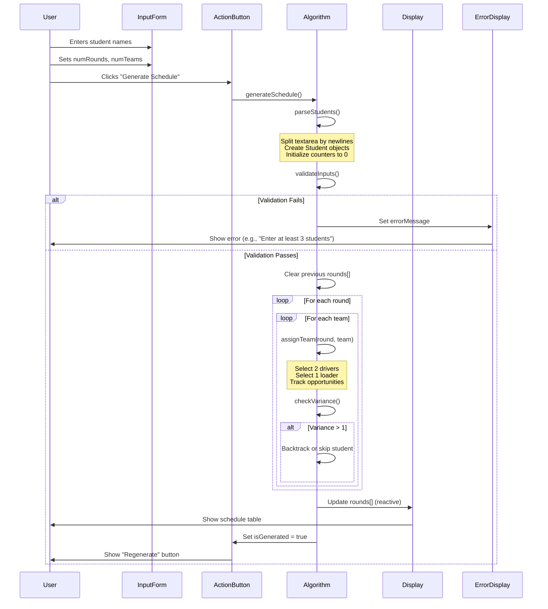
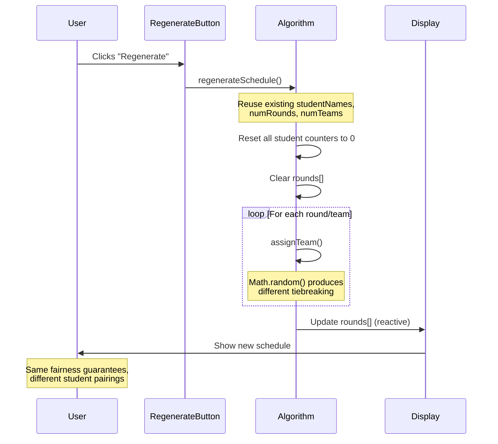
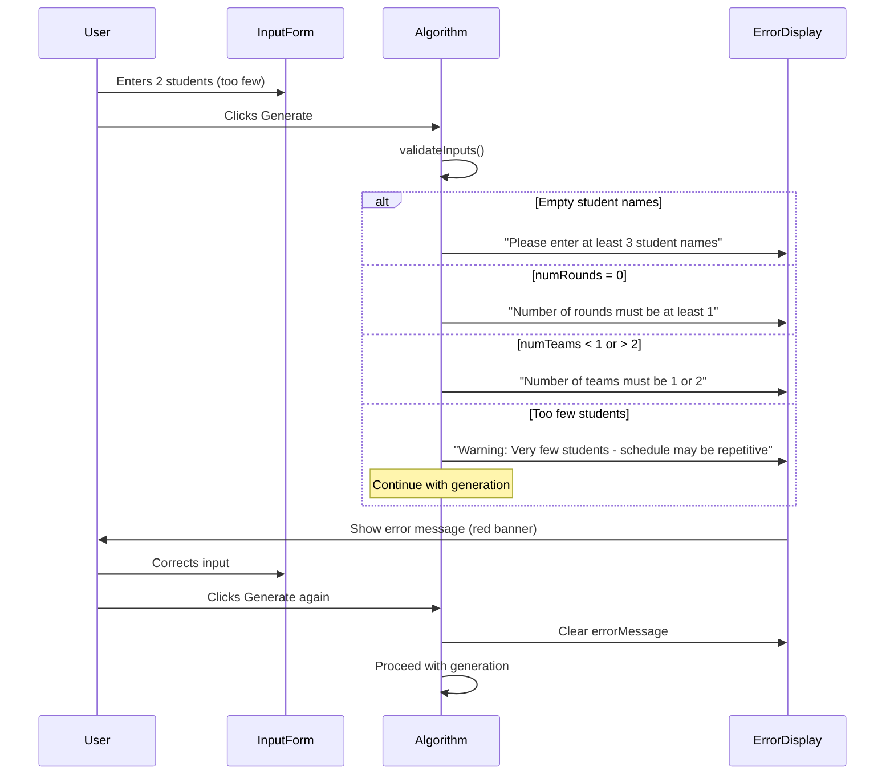
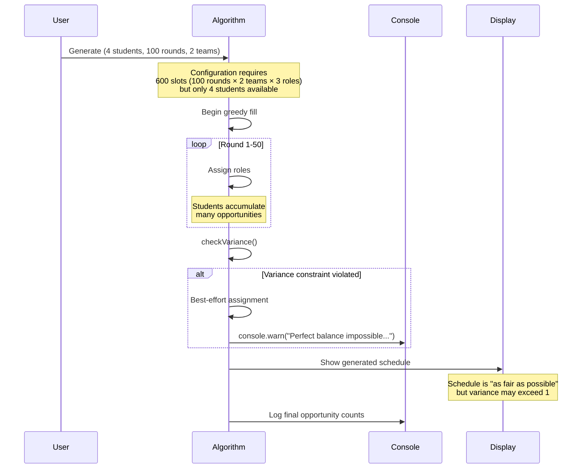

# Core Workflows

## Workflow: Generate Initial Schedule

This sequence shows the complete flow from user input to displaying the generated schedule.

---

## Workflow: Regenerate Schedule

This sequence shows how regeneration reuses inputs but produces different results via randomization.

---

## Workflow: Error Handling - Invalid Input

---

## Workflow: Edge Case - Impossible Perfect Balance

---
