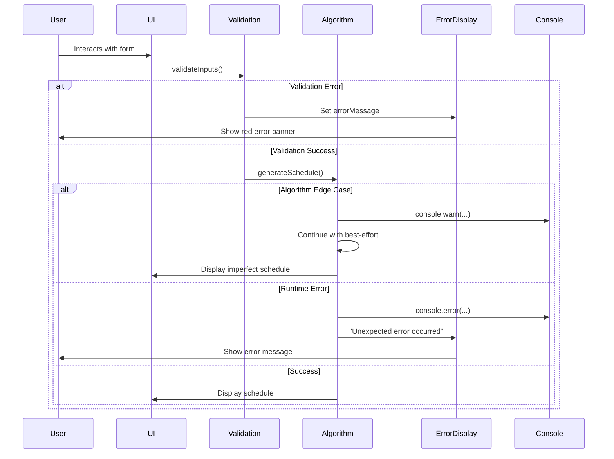

# Error Handling Strategy

## Error Types

The application handles three categories of errors:

1. **Validation Errors:** User input doesn't meet requirements (e.g., empty student list)
2. **Algorithm Edge Cases:** Configuration is impossible to perfectly balance (e.g., 4 students, 100 rounds)
3. **Runtime Errors:** Unexpected JavaScript errors (e.g., null reference)

## Error Flow



---

## Error Response Format

**User-Facing Errors (displayed in `errorMessage`):**

```javascript
// Validation errors
"Please enter at least 3 student names"
"Number of rounds must be at least 1"
"Number of teams must be 1 or 2"

// Algorithm warnings (user-facing)
"Warning: Very few students - schedule may be repetitive"
"Unable to generate perfectly balanced schedule (see console for details)"

// Runtime errors (generic)
"An unexpected error occurred. Please try again or check the browser console for details."
```

**Developer Errors (logged to console):**

```javascript
// Edge case warnings
console.warn('Perfect balance impossible with configuration:', { students: 4, rounds: 100, teams: 2 });
console.warn('Student assigned to both teams in same round (fallback used)');

// Algorithm debugging
console.log('Driver opportunities:', this.students.map(s => ({ name: s.name, count: s.driverCount })));
console.log('Loader opportunities:', this.students.map(s => ({ name: s.name, count: s.loaderCount })));

// Runtime errors
console.error('Failed to parse students:', error);
```

---

## Frontend Error Handling Implementation

**Error Display Component:**

```html
<!-- Error banner (conditionally shown) -->
<div
  x-show="errorMessage"
  class="bg-red-100 border border-red-400 text-red-700 px-4 py-3 rounded mb-4"
  role="alert"
>
  <strong class="font-bold">Error:</strong>
  <span class="block sm:inline" x-text="errorMessage"></span>
</div>
```

**Error Handling in Methods:**

```javascript
generateSchedule() {
  // Clear previous errors
  this.errorMessage = '';

  try {
    // Validation
    if (!this.validateInputs()) {
      return; // Error message already set by validateInputs()
    }

    // Algorithm execution
    this.students = this.parseStudents();
    this.rounds = [];
    this.runGreedyFillAlgorithm();
    this.isGenerated = true;

  } catch (error) {
    // Catch unexpected errors
    console.error('Schedule generation failed:', error);
    this.errorMessage = 'An unexpected error occurred. Please check the console for details.';
  }
}

validateInputs() {
  if (!this.studentNames.trim()) {
    this.errorMessage = 'Please enter at least 3 student names';
    return false;
  }

  const studentCount = this.parseStudents().length;
  if (studentCount < 3) {
    this.errorMessage = 'Please enter at least 3 student names';
    return false;
  }

  if (this.numRounds < 1) {
    this.errorMessage = 'Number of rounds must be at least 1';
    return false;
  }

  if (this.numTeams < 1 || this.numTeams > 2) {
    this.errorMessage = 'Number of teams must be 1 or 2';
    return false;
  }

  // Clear any previous error
  this.errorMessage = '';
  return true;
}
```

---
