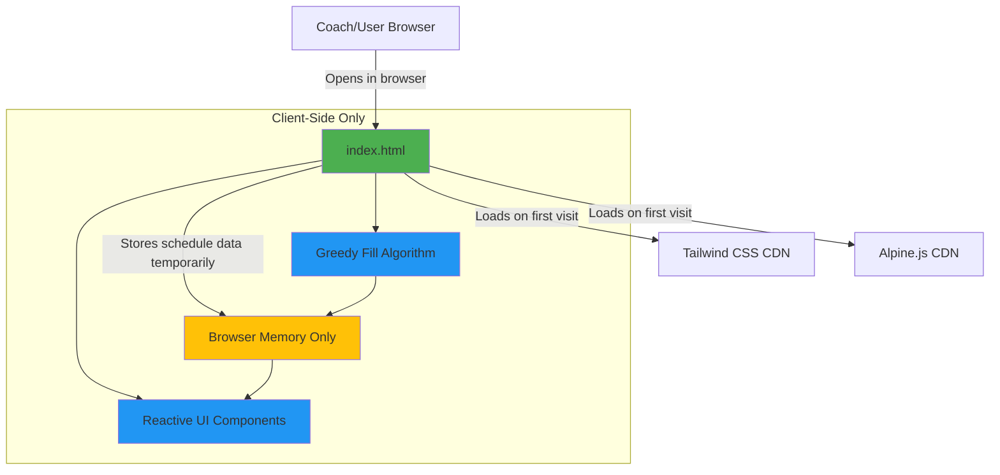

# High Level Architecture

## Technical Summary

The VexIQ Team Pairing Tool is a **zero-backend static web application** delivered as a single HTML file with embedded JavaScript and CSS via CDN. The architecture is radically simplified: all computation (the greedy fill scheduling algorithm) executes client-side in the browser using Alpine.js for reactive state management. Tailwind CSS provides utility-first styling with no build step required.

There are no integration points, no API calls, and no external services beyond the initial CDN loads for Tailwind and Alpine.js. After the page loads, the application works completely offline. Data exists only in browser memory and is lost on page refresh (intentional design for privacy).

This architecture achieves the PRD goals of same-day delivery (4-5 hours), zero setup, offline-first operation, and privacy by design through radical simplification: eliminating every component that isn't absolutely necessary for generating fair tournament schedules.

## Platform and Infrastructure Choice

**Platform:** Client-side only (No backend infrastructure)

**Key Services:**
- Static file hosting (GitHub Pages, Netlify, Vercel static hosting, or local file system)
- CDN services (jsDelivr or unpkg for Tailwind/Alpine.js)

**Deployment Host and Regions:**
- Primary: GitHub Pages (global CDN via GitHub's infrastructure)
- Alternative: Any static host or direct file:// access
- No region selection required (CDN automatically serves from nearest edge)

## Repository Structure

**Structure:** Single-file application with documentation repository

**Monorepo Tool:** N/A (not applicable for single-file project)

**Package Organization:**
```
vex-team-builder/
├── index.html              # The entire application
├── docs/                   # Documentation
│   ├── prd.md
│   ├── architecture.md
│   └── README.md
├── .github/
│   └── workflows/
│       └── deploy.yaml     # GitHub Pages deployment
└── README.md               # Project overview
```

## High Level Architecture Diagram



## Architectural Patterns

- **Static Single-Page Application:** Single HTML file with embedded JavaScript - no routing, no navigation, all functionality on one screen. _Rationale:_ Eliminates build complexity and matches the simple linear workflow (input → generate → view results)

- **Reactive Data Binding:** Alpine.js `x-data` and `x-model` directives bind UI to data model. _Rationale:_ Eliminates manual DOM manipulation, making schedule display and regeneration trivial despite the complex algorithm

- **Greedy Algorithm Pattern:** Round-by-round assignment with role-specific opportunity tracking and variance enforcement. _Rationale:_ Optimal for fair distribution with O(n*r) complexity suitable for client-side execution

- **Ephemeral State:** No localStorage, sessionStorage, or persistence - all data cleared on page refresh. _Rationale:_ Privacy by design (no PII stored) and matches use case (coaches regenerate schedules as needed)

- **Progressive Enhancement:** Core functionality works without JavaScript (shows form), enhanced with Alpine.js for reactive behavior. _Rationale:_ Graceful degradation, though realistically the algorithm requires JavaScript

- **Utility-First CSS:** Tailwind CSS classes directly in HTML. _Rationale:_ No CSS build step, rapid styling, excellent defaults for print/projection

---
